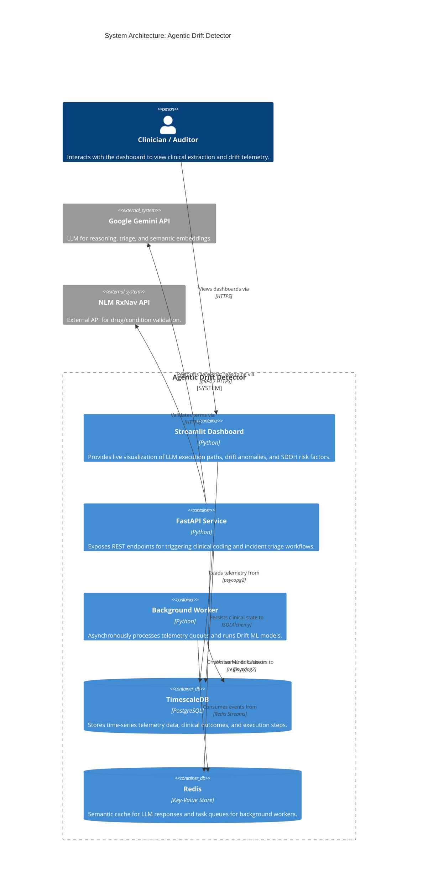
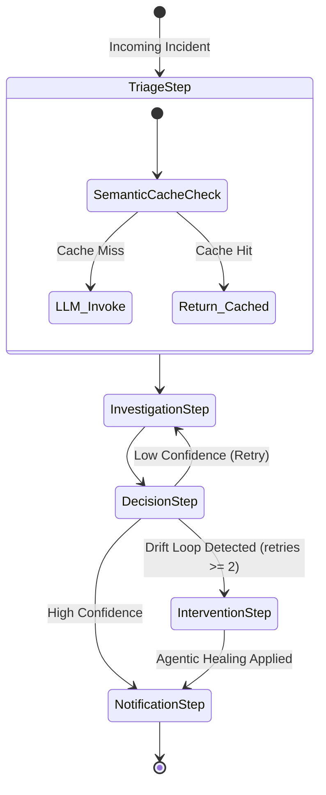
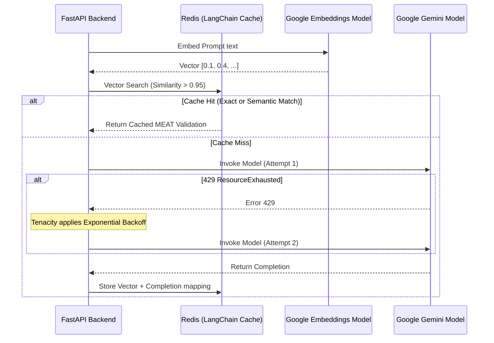

# System Architecture

Agentic Drift Detector is designed as a distributed, event-driven, microservice architecture that strictly separates stateless reasoning (LangGraph/LLMs), stateful telemetry (TimescaleDB), and background processing. 

This document details the system design via the C4 model and sequence flows.

## 1. C4 Container Architecture

The system is decoupled into 5 core Docker containers. 

## 2. Clinical Workflow Engine (LangGraph)

The core intelligent processing is handled via LangGraph, treating LLM executions as a robust state machine. This allows for cyclical reasoning, deterministic fallbacks, and agentic healing.

## 3. Resilience & Cost Engineering Sequence

To prevent API rate-limit crashes and reduce cloud costs, we employ a **Semantic Caching** and **Exponential Backoff** strategy around the Gemini API.

## 4. Key Architectural Decisions (ADRs)

1. **State Machine over Chains**: We chose LangGraph over standard LangChain sequential chains. LLMs are non-deterministic; by using a state graph, we can tightly control retry loops and force "Agentic Healing" (deterministic intervention) if the LLM enters an infinite drift loop.
2. **Semantic Caching**: In clinical settings, the same condition strings (e.g., "Type 2 DM w/ neuropathy") appear thousands of times. Rather than paying the LLM token cost every time, the vector cache intercepts similar queries and responds in milliseconds.
3. **Decoupled Telemetry**: The LLM engine does not block on telemetry writes. Telemetry is emitted and processed asynchronously, ensuring the critical reasoning path remains fast.
